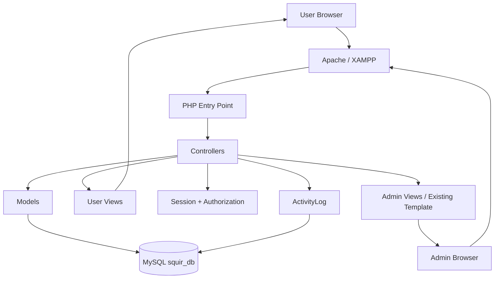
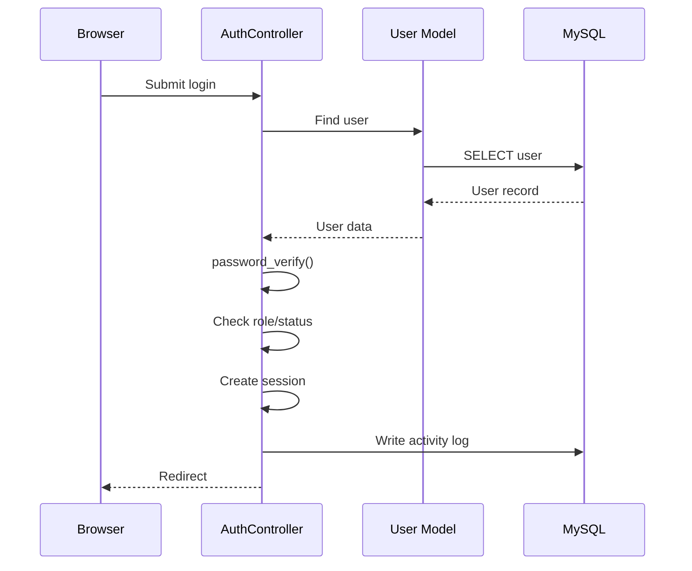

# Squir — System Architecture

## 1. Architecture Goal
Squir uses a lightweight MVC-style Native PHP OOP architecture. It separates request handling, database access, presentation, configuration, and shared components while avoiding unnecessary enterprise complexity.

## 2. Technology
| Layer | Technology |
|---|---|
| Frontend | HTML, Tailwind CSS, JavaScript |
| Backend | Native PHP, OOP |
| Database | MySQL |
| Server | XAMPP / Apache |
| DB access | PDO |
| Auth | PHP sessions |
| Login password | `password_hash()` / `password_verify()` |
| Vault secret | PHP encryption/decryption |
| Source control | Git |

React is intentionally not used.

## 3. Project Structure
```text
Squir/
├── dist/                         # Teacher-provided template
│   ├── admin/                    # Existing admin design, if present
│   └── assets/                   # Template assets
├── tailwind_plugins/
├── app/
│   ├── controllers/
│   │   ├── AdminController.php
│   │   ├── AuthController.php
│   │   ├── DashboardController.php
│   │   ├── FavoriteController.php
│   │   ├── FolderController.php
│   │   ├── NoteController.php
│   │   ├── SearchController.php
│   │   ├── TaskController.php
│   │   └── VaultController.php
│   ├── models/
│   │   ├── ActivityLog.php
│   │   ├── Favorite.php
│   │   ├── Folder.php
│   │   ├── Note.php
│   │   ├── Task.php
│   │   ├── User.php
│   │   └── Vault.php
│   └── views/
│       ├── auth/
│       ├── dashboard/
│       ├── vault/
│       ├── notes/
│       ├── tasks/
│       ├── folders/
│       ├── favorites/
│       └── search/
├── config/
│   ├── config.php
│   └── database.php
├── includes/
│   ├── dbconnect.php
│   ├── auth.php
│   ├── admin_auth.php
│   ├── header.php
│   ├── navbar.php
│   ├── sidebar.php
│   ├── footer.php
│   └── functions.php
├── database/
│   └── squir_db.sql
├── assets/
│   ├── css/
│   ├── js/
│   └── images/
├── index.php
├── register.php
├── logout.php
└── .htaccess
```

## 4. Responsibilities
**Controllers:** request flow, validation, authorization, model coordination, redirects/views.  
**Models:** database operations and data access; no HTML.  
**Views:** HTML/presentation; no SQL.  
**Config:** application/database configuration and autoloading.  
**Includes:** shared layout/auth/helper components.  
**Database:** SQL schema/migrations.  
**Dist:** teacher template and reusable admin/design assets.

## 5. Top-Level Overview


## 6. Request Flow
```text
Browser
  ↓
PHP entry point
  ↓
Authentication / authorization
  ↓
Controller
  ↓
Model
  ↓
PDO
  ↓
MySQL
  ↓
Model result
  ↓
Controller
  ↓
View
  ↓
Browser
```

## 7. Authentication Flow


## 8. Authorization
Roles:
- `user`
- `admin`

Users may access only their own private records.
Admins may access approved admin functions.
Authorization must be checked on the server.

## 9. Ownership Rule
Use ownership conditions in private queries:
```sql
SELECT *
FROM passwords
WHERE password_id = :password_id
  AND user_id = :user_id;
```
Never trust a browser-supplied record ID by itself.

## 10. Secret Data Flow
### Login password
`password → password_hash() → users.password_hash`

Verification:
`submitted password → password_verify() → stored hash`

### Vault password
`vault password → PHP encryption → passwords.account_password`

Viewing:
`encrypted value → authorization check → PHP decryption → controlled display`

## 11. Activity Logging
Important actions can include:
`USER_LOGIN`, `USER_LOGOUT`, `PASSWORD_ADDED`, `PASSWORD_UPDATED`, `PASSWORD_DELETED`, `NOTE_ADDED`, `NOTE_UPDATED`, `NOTE_DELETED`, `TASK_CREATED`, `TASK_UPDATED`, `TASK_COMPLETED`, `ACCOUNT_SUSPENDED`.

Never log plaintext secrets.

## 12. Design Pattern
Use lightweight MVC organization:
`Model → data`, `View → presentation`, `Controller → request/application flow`.

Do not introduce extra services/repositories/frameworks unless a real requirement needs them.

## 13. Template Integration
- Keep the teacher template.
- Reuse `dist/assets`.
- Reuse the existing `dist/admin` design if present.
- Adapt template UI into `app/views` for Squir user pages.
- Shared layout goes in `includes/`.
- Squir custom styling goes in `assets/`.

## 14. Base URL
Prefer:
```php
define('BASE_URL', '/Squir/');
```
Then:
```php
<link rel="stylesheet" href="<?= BASE_URL ?>dist/assets/...">
<link rel="stylesheet" href="<?= BASE_URL ?>assets/css/custom.css">
```

## 15. Architecture Boundaries
Do not introduce React, APIs, microservices, queues, or unnecessary abstraction layers unless the approved requirements change.
