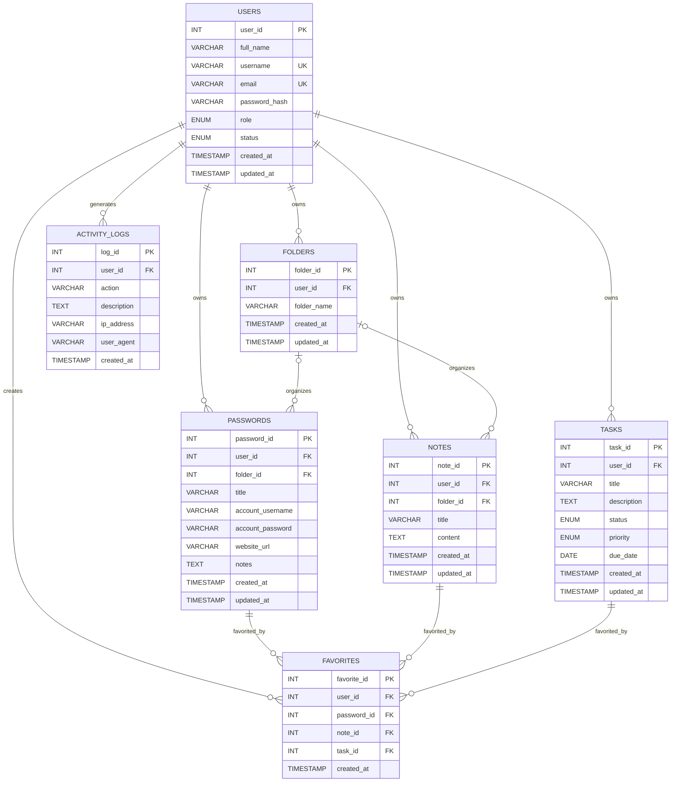

# Squir — Database Schema Documentation

## 1. Database
**Database:** `squir_db`  
**DBMS:** MySQL  
**Environment:** XAMPP

This document follows the current database supplied for Squir.

## 2. Tables

### users
`user_id` PK AI; `full_name`; `username` UNIQUE; `email` UNIQUE; `password_hash`; `role`; `status`; `created_at`; `updated_at`.

`role`: `user | admin`  
`status`: `active | inactive | suspended`

### folders
`folder_id` PK AI; `user_id` FK; `folder_name`; `created_at`; `updated_at`.

`users → folders`: 1:N, `ON DELETE CASCADE`.

### passwords
`password_id` PK AI; `user_id` FK; `folder_id` nullable FK; `title`; `account_username` nullable; `account_password`; `website_url` nullable; `notes` nullable; timestamps.

`users → passwords`: 1:N, CASCADE.  
`folders → passwords`: 1:N optional, SET NULL.

`account_password` must contain an encrypted value, not a plaintext value.

### notes
`note_id` PK AI; `user_id` FK; `folder_id` nullable FK; `title`; `content`; timestamps.

`users → notes`: 1:N, CASCADE.  
`folders → notes`: 1:N optional, SET NULL.

### tasks
`task_id` PK AI; `user_id` FK; `title`; `description`; `status`; `priority`; `due_date`; timestamps.

`status`: `pending | in_progress | completed`  
`priority`: `low | medium | high`

`users → tasks`: 1:N, CASCADE.

### favorites
`favorite_id` PK AI; `user_id` FK; nullable `password_id` FK; nullable `note_id` FK; nullable `task_id` FK; `created_at`.

The CHECK constraint requires exactly one of `password_id`, `note_id`, `task_id` to be non-NULL.

Each referenced item is deleted with its favorite because all three item FKs use `ON DELETE CASCADE`.

The PHP application must also prevent duplicate favorites because nullable FK columns make a simple multi-column UNIQUE constraint unsuitable for this exact rule.

### activity_logs
`log_id` PK AI; nullable `user_id` FK; `action`; `description`; nullable `ip_address`; nullable `user_agent`; `created_at`.

`users → activity_logs`: 1:N, `ON DELETE SET NULL`.

Indexes:
- `idx_logs_user(user_id)`
- `idx_logs_created(created_at)`

## 3. ERD


## 4. Relationship Matrix

| Parent | Child | Cardinality | Delete |
|---|---|---:|---|
| users | folders | 1:N | CASCADE |
| users | passwords | 1:N | CASCADE |
| users | notes | 1:N | CASCADE |
| users | tasks | 1:N | CASCADE |
| users | favorites | 1:N | CASCADE |
| users | activity_logs | 1:N | SET NULL |
| folders | passwords | 1:N optional | SET NULL |
| folders | notes | 1:N optional | SET NULL |
| passwords | favorites | 1:N possible | CASCADE |
| notes | favorites | 1:N possible | CASCADE |
| tasks | favorites | 1:N possible | CASCADE |

## 5. RLS
MySQL does not provide PostgreSQL-style Row Level Security policies in this implementation.

Therefore:
**RLS: Not applicable.**

Equivalent security is enforced by PHP authorization and ownership checks.

Example:
```sql
SELECT *
FROM notes
WHERE note_id = :note_id
  AND user_id = :user_id;
```

Admin-only operations must verify the authenticated user's `role = 'admin'`.

## 6. Migration Procedure
Current schema source:
`database/squir_db.sql`

When changing the schema:
1. Update SQL.
2. Update `SCHEMA.md`.
3. Update affected models.
4. Update controllers/business logic.
5. Update affected views/forms.
6. Test foreign keys and delete behavior.
7. Update the ERD.

Never change PHP/database behavior while leaving schema documentation stale.

## 7. Seeded Admin
Username: `admin`  
Email: `adminSquir@gmail.com`  
Role: `admin`  
Status: `active`

The actual login password must be stored as a generated password hash. Do not commit plaintext credentials.

## 8. Security Rules
Login credential: hash, never decrypt.  
Vault credential: encrypt, decrypt only after authorization.  
Never log plaintext secrets.
